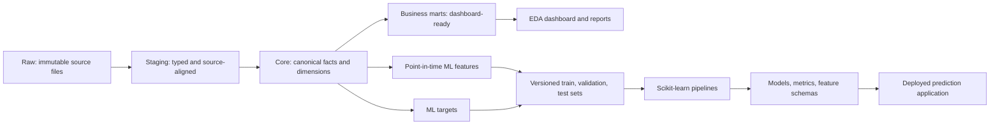

# IT5006 Group 11 Data Architecture

Status: **authoritative project specification**

Applies to: Milestones 1, 2, and 3

Last updated: 2026-09-08

## 1. Purpose

This document defines how project data must be stored, transformed, validated,
and consumed. Human contributors and AI agents must read this document before
adding a dataset, transformation, dashboard metric, machine-learning feature,
or deployment input.

The architecture has four goals:

1. Preserve the original Olist data exactly as received.
2. Make every derived table deterministic and reproducible from code.
3. Prevent inconsistent dashboard calculations and machine-learning leakage.
4. Support the complete project without unnecessary database infrastructure.

## 2. Authoritative data flow



The raw layer is the source of record. The core layer is the analytical source
of truth. Business marts and ML datasets are purpose-specific derivatives; they
must never redefine or overwrite canonical records.

## 3. Directory contract

```text
data/
  raw/                         Original source files; local and immutable
  staging/                     Rebuildable typed source-level tables
  processed/
    core/                      Canonical facts and dimensions
    marts/                     Dashboard and reporting tables
    ml/                        Features, targets, and split assignments
  metadata/                    Dictionaries, manifests, and quality reports
preprocessing/                 Ingestion, core, mart, and validation pipelines
src/
  features/                    Point-in-time features, targets, and splits
  models/                      Training and evaluation code
  common/                      Shared constants and utilities
notebooks/
  01_eda/                      Exploratory analysis
  02_problem_definition/       Target and business-problem definition
  03_modeling/                 Experiments; not production transformations
deployment/                    Inference and final application code
artifacts/
  models/                      Serialized fitted pipelines
  metrics/                     Evaluation results
  feature_schemas/             Inference input contracts
tests/                         Data-contract and code tests
docs/                          Project specifications and decisions
```

Empty directories contain `.gitkeep` so the structure is available after a
clone. Local data and generated model artifacts are excluded by `.gitignore`.

The four compressed CSV files currently stored directly under `data/` are the
legacy Milestone 1 dashboard interface. They may remain in place until the
dashboard loader is deliberately migrated to `data/processed/marts/`.

## 4. Layer specifications

### 4.1 Raw layer

`data/raw/` contains exact copies of the nine original Olist CSV files.

Rules:

- Never edit, rename columns in, deduplicate, or overwrite a raw file.
- Copy files byte-for-byte; do not synthesize or manually reconstruct data.
- Record the file name, byte count, row count, and SHA-256 checksum in a raw
  manifest when the ingestion pipeline is implemented.
- Raw files stay local and must not be committed unless the team explicitly
  changes the data-distribution policy.
- A pipeline must fail clearly when an expected file is absent.

### 4.2 Staging layer

`data/staging/` contains one output per source table. Staging may standardize
column names, parse dates, assign data types, and handle documented malformed
values, but it must retain the source table's grain.

Staging transformations must be deterministic. They must not perform business
aggregations, dashboard calculations, target construction, or cross-table joins.

### 4.3 Canonical core layer

`data/processed/core/` contains reusable facts and dimensions. Each table must
have an explicit grain and primary-key expectation.

| Table | Required grain |
| --- | --- |
| `fact_orders` | one row per `order_id` |
| `fact_order_items` | one row per (`order_id`, `order_item_id`) |
| `fact_payments` | one row per source payment record |
| `fact_reviews` | one row per review record |
| `dim_customers` | one row per customer identifier at the documented level |
| `dim_products` | one row per `product_id` |
| `dim_sellers` | one row per `seller_id` |
| `dim_geography` | one row per documented geographic key |

`customer_id` identifies a customer record associated with an order, whereas
`customer_unique_id` is the identifier for customer-level behavior. Code must
not treat these identifiers as interchangeable.

Order-level measures must not be summed from an item-grain table. For example,
if total order payment is repeated on every order item, summing that field will
double-count multi-item orders. Joins must document their expected cardinality.

### 4.4 Business mart layer

`data/processed/marts/` contains stable, presentation-ready tables. Recommended
marts are:

- `mart_order_dashboard`: one row per order, including observed outcomes.
- `mart_category_daily`: one row per date and product category.
- `mart_state_summary`: one row per state and reporting period.
- `mart_data_quality`: validation results for operational visibility.

Normal dashboard pages must read business marts, not reproduce joins and metric
logic independently. Access to core or staging data is allowed only for an
explicit drill-down or data-quality use case.

Marts are logical views but may be materialized as Parquet or compressed CSV.
Runtime SQL views are optional. For this dataset, reproducible materialized
tables are preferred because they simplify Streamlit deployment.

### 4.5 Machine-learning layer

`data/processed/ml/` must keep inputs, outcomes, and data splits separate:

| Dataset | Grain | Purpose |
| --- | --- | --- |
| `order_features_at_purchase` | one row per order | predictor values known at prediction time |
| `order_targets` | one row per order | classification and regression outcomes |
| `split_assignments` | one row per order | reproducible train/validation/test membership |

The default prediction moment is **immediately after checkout**. Every feature
must have been available at that moment. If the prediction moment changes, it
must be recorded as an architecture decision and the feature dataset renamed or
versioned.

Candidate features include purchase time components, customer and seller
geography, product category and dimensions, item count, price, freight, and
checkout payment information. Historical aggregates must use only events that
occurred before the order being predicted.

The following observed outcomes are prohibited as model features:

- actual customer or carrier delivery dates;
- delivery duration, late days, `is_late`, or `is_on_time`;
- review score, review text, or review timestamps;
- post-checkout status information; and
- aggregates that include future orders or the target order's outcome.

The initial targets are:

- classification: `is_late`, defined from promised versus actual delivery; and
- regression: `delivery_days`, defined from purchase to actual delivery.

Eligibility rules, such as whether cancelled or undelivered orders are excluded,
must be implemented once in target-building code and documented in metadata.

## 5. Reproducible splitting and modelling

- Generate split assignments once with a documented seed and split version.
- Prefer a chronological held-out test set when claiming to predict future
  orders. Use a stratified split for same-period classification experiments.
- If customer history is used, group by `customer_unique_id` so the same person
  cannot leak between training and evaluation sets.
- Never use the test set to select features, tune thresholds, or choose a model.
- Missing-value handling, encoding, scaling, sampling, and estimation must be
  combined in a fitted scikit-learn pipeline.
- Save the complete fitted pipeline, not only the estimator.
- Store the input feature schema, training configuration, random seed, metrics,
  and training-data version beside each model artifact.

At minimum, classification evaluation should include precision, recall, F1,
PR-AUC, ROC-AUC, and a confusion matrix. Regression evaluation should include
MAE, RMSE, and R-squared.

## 6. Storage conventions

- Raw inputs: original CSV format.
- Staging, core, and ML tables: Parquet is preferred for preserved types and
  compression.
- Small deployment marts: Parquet or `.csv.gz` are both acceptable.
- Model pipelines: `.joblib`.
- Metrics, schemas, and run metadata: JSON or Markdown.

Do not add SQLite, DuckDB, or a remote database unless it solves a demonstrated
need. The architecture is based on data contracts and reproducible layers, not
on a particular storage engine.

## 7. Required validation

Every materialized dataset must be checked before publication. Tests should
cover, where applicable:

- expected columns and data types;
- unique and non-null primary keys;
- accepted categorical values;
- plausible numeric and date ranges;
- source and output row counts;
- referential integrity between facts and dimensions;
- join cardinality and unexpected row multiplication;
- deterministic output for identical inputs;
- raw-file checksum agreement; and
- absence of prohibited outcome columns from ML features.

A failed required validation must stop the pipeline rather than silently publish
an invalid table.

## 8. Milestone responsibilities

### Milestone 1

Build and validate raw, staging, core, and business-mart transformations. The EDA
dashboard consumes business marts. Outcome fields are acceptable in descriptive
dashboard marts when clearly labelled.

### Milestone 2

Build versioned point-in-time features, targets, split assignments, training
pipelines, and evaluation outputs. Notebooks may explore models but reusable
feature and training logic must be moved into `src/`.

### Milestone 3

Select at least one complete fitted pipeline for deployment. The deployed app
must validate inference inputs against the saved feature schema and apply the
same preprocessing used during training. Dashboard reporting continues to read
business marts; prediction pages use model artifacts.

## 9. Change rules for contributors and AI agents

Before changing the data flow:

1. Identify the affected layer and table grain.
2. Confirm whether the change uses information available at prediction time.
3. Add or update validation for the affected contract.
4. Keep transformations in code; never patch generated datasets manually.
5. Update this document when a layer, grain, prediction moment, target, storage
   convention, or consumer contract changes.
6. Do not move the legacy dashboard files until the loader and documentation are
   updated in the same change.

When a requirement is ambiguous, preserve raw data and existing interfaces, and
record the unresolved decision rather than inventing data or silently changing a
metric definition.
