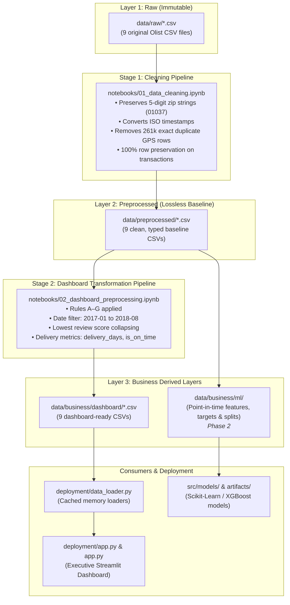

# IT5006 Group 11 Data Architecture

Status: **Authoritative Project Specification**  
Applies to: **Milestones 1, 2, and 3**  
Last updated: **2026-09-11**

---

## 1. Purpose & Guiding Principles

This document defines how project data must be stored, transformed, validated, and consumed across all phases of the IT5006 project. **All human contributors and AI coding agents must read and strictly adhere to this architecture** before adding or modifying any dataset, transformation script, notebook, dashboard metric, or machine learning model.

### Four Core Architecture Principles:
1. **Raw Immutability**: Preserve the original 9 Olist CSV files exactly as downloaded from Canvas.
2. **Deterministic 3-Layer Lineage**: Every derived table must be reproducible from code through a clear 3-layer architecture (`raw` $\rightarrow$ `preprocessed` $\rightarrow$ `business`).
3. **Leakage & Bias Prevention**: Keep executive dashboard filtering (e.g. date clipping to stable operating months) strictly isolated from machine learning datasets (`business/dashboard/` vs. `business/ml/`).
4. **Course Compliance**: Maintain strict compliance with the directory specification defined in **Page 7 of the IT5006 Project Description**.

---

## 2. Authoritative Data Flow & Lineage



---

## 3. Directory Contract (Page 7 Compliance)

To satisfy grading requirements, root folders are strictly restricted to the official course structure:

```text
IT5006_GRP11/
├── data/
│   ├── raw/                  # 9 original Olist CSV files (read-only, immutable)
│   ├── preprocessed/         # 9 cleaned baseline CSVs (lossless type standardization)
│   └── business/
│       ├── dashboard/        # 9 processed CSVs with business rules applied (Streamlit ready)
│       └── ml/               # [Phase 2] Point-in-time features, targets, and train/test splits
│
├── notebooks/
│   ├── 01_data_cleaning.ipynb            # Pipeline: data/raw/ -> data/preprocessed/
│   └── 02_dashboard_preprocessing.ipynb  # Pipeline: data/preprocessed/ -> data/business/dashboard/
│
├── deployment/               # Official directory for the dashboard & inference apps
│   ├── app.py                # Main Streamlit dashboard application entrypoint
│   ├── data_loader.py        # Central data access layer reading from data/business/dashboard/
│   ├── charts.py             # Plotly visualization components
│   ├── tables.py             # KPI summary tables and scorecards
│   └── theme.py              # CSS styling and color palette
│
├── src/                      # Reusable Python modules
│   ├── common/               # Shared constants, column types, and utility functions
│   ├── features/             # [Phase 2] Feature engineering and encoders
│   └── models/               # [Phase 2] Model training, hyperparameter tuning, and evaluation
│
├── docs/
│   ├── data_architecture.md  # This document: authoritative system architecture
│   └── references/           # Course Project Description PDF & 6 literature review papers
│
├── artifacts/                # Generated build outputs (not source code)
│   ├── models/               # Serialized .joblib model pipelines
│   └── metrics/              # Model evaluation metrics & confusion matrices
│
├── app.py                    # Root entrypoint launcher for Streamlit Cloud
├── requirements.txt          # Frozen dependencies
└── README.md                 # Project documentation and navigation guide
```

> [!WARNING]
> **Prohibited Root Directories**: Do not create or reintroduce folders such as `dashboard/`, `Clean data/`, `Dashboard data/`, `Project files/`, or `preprocessing/` under root. Any helper code belongs in `src/`, notebooks in `notebooks/`, and application components in `deployment/`.

---

## 4. Layer Specifications & Data Contracts

### 4.1 Layer 1: Raw (`data/raw/`)
Contains byte-for-byte copies of the 9 original Olist dataset files:
- `olist_orders_dataset.csv`
- `olist_order_items_dataset.csv`
- `olist_order_payments_dataset.csv`
- `olist_order_reviews_dataset.csv`
- `olist_customers_dataset.csv`
- `olist_sellers_dataset.csv`
- `olist_products_dataset.csv`
- `olist_geolocation_dataset.csv`
- `product_category_name_translation.csv`

**Rules**:
- Immutable: Never edit, rename columns, filter, or overwrite any raw file.
- Applications and ML scripts must **never** read directly from `data/raw/`.

---

### 4.2 Layer 2: Preprocessed (`data/preprocessed/`)
Generated exclusively by [`notebooks/01_data_cleaning.ipynb`](file:///Users/bensonwu/Projects/IT5006_GRP11/notebooks/01_data_cleaning.ipynb).

**Transformations Applied**:
- **Lossless Typings**: Timestamps parsed to ISO-8601 datetimes (`YYYY-MM-DD HH:MM:SS`); IDs preserved as clean strings; numeric values cast to float/int.
- **Zip-Code Preservation**: 5-digit Brazilian postal code prefixes are stored as **zero-padded strings** (e.g. `'01037'`), avoiding integer truncations.
- **Geolocation Deduplication**: 261,831 byte-identical duplicate rows are removed from `olist_geolocation_dataset.csv`, leaving 738,332 unique geographic coordinate rows.
- **Row Conservation**: Zero rows are dropped from all 8 transaction and dimension tables.

---

### 4.3 Layer 3A: Business Dashboard (`data/business/dashboard/`)
Generated exclusively by [`notebooks/02_dashboard_preprocessing.ipynb`](file:///Users/bensonwu/Projects/IT5006_GRP11/notebooks/02_dashboard_preprocessing.ipynb).

**Business Rules Applied (Steps A–G)**:
- **Rule A (Order Timestamps)**: Drops orders with timestamp sequence errors (`order_delivered_carrier_date < order_approved_at` or `order_delivered_customer_date < order_delivered_carrier_date`).
- **Rule B (Review Collapsing)**: Collapses multi-reviews for the same order into a single row, retaining the **lowest review score** to reflect customer friction.
- **Rule C (Invalid Payments)**: Filters out invalid records where `payment_value == 0` and `payment_type == 'not_defined'`.
- **Rule D (Ghost Orders)**: Drops orders without associated items in `olist_order_items_dataset.csv`.
- **Rule E (Derived Delivery Columns)**: Calculates `delivery_days` (purchase to customer delivery) and boolean `is_on_time` (`order_delivered_customer_date <= order_estimated_delivery_date`).
- **Rule F (Revenue)**: Calculates `item_revenue = price + freight_value`.
- **Rule G (Stable Operating Window)**: Truncates orders to the complete, stable operating period (**2017-01 through 2018-08**), excluding incomplete border months.
- **Pass-through**: Dimension tables (`customers`, `sellers`, `products`, `geolocation`, `translation`) pass through unchanged.

---

### 4.4 Layer 3B: Business ML (`data/business/ml/`) — *Phase 2*
Reserved for predictive modeling (e.g., delivery delay prediction, customer lifetime value, review rating prediction).

**Rules for ML Feature Engineering**:
- **Cutoff Time**: Features must only represent information available at the moment of checkout (`order_purchase_timestamp`).
- **Prohibited Features (Data Leakage)**:
  - Any post-purchase timestamps (`order_approved_at`, `order_delivered_carrier_date`, `order_delivered_customer_date`).
  - Target variables or derived delivery metrics (`delivery_days`, `is_on_time`).
  - Review score and review comments.
- **Split Isolation**: Train/validation/test splits must be stratified or chronological, versioned, and grouped by `customer_unique_id` to prevent cross-set leakage.

---

## 5. Consumer Standards (Streamlit & Deployment)

1. **Access Path**:
   All dashboard views in `deployment/` must load data via [`deployment/data_loader.py`](file:///Users/bensonwu/Projects/IT5006_GRP11/deployment/data_loader.py).
2. **Caching**:
   Use `@st.cache_data` for all data loading routines to ensure sub-second dashboard interactions.
3. **No Direct Ad-Hoc Filtering**:
   Pages should visualize pre-calculated metrics rather than recalculating complex joins repeatedly across multiple UI widgets.

---

## 6. Mandatory Rules for Future Contributors & AI Agents

When interacting with this repository, every contributor and AI agent must observe the following constraints:

1. **Do Not Recreate Stale Directories**:
   Never create `data/staging/`, `data/processed/`, `Clean data/`, `Dashboard data/`, `Project files/`, `dashboard/`, or `preprocessing/`.
2. **Respect the Lineage**:
   - For data cleaning changes $\rightarrow$ modify [`notebooks/01_data_cleaning.ipynb`](file:///Users/bensonwu/Projects/IT5006_GRP11/notebooks/01_data_cleaning.ipynb).
   - For dashboard data preparation changes $\rightarrow$ modify [`notebooks/02_dashboard_preprocessing.ipynb`](file:///Users/bensonwu/Projects/IT5006_GRP11/notebooks/02_dashboard_preprocessing.ipynb).
   - For dashboard UI / visualization changes $\rightarrow$ modify files in [`deployment/`](file:///Users/bensonwu/Projects/IT5006_GRP11/deployment/).
3. **Never Commit Without Explicit Instruction**:
   Always keep code and data modifications in the working tree for human team review unless the user explicitly commands a `git commit`.
4. **Preserve Relative Path Autonomy**:
   Notebooks and scripts must resolve the repository root dynamically (e.g., using `Path(__file__).resolve().parent...` or scanning upwards for `data/raw/olist_orders_dataset.csv`), so they execute identically across macOS, Windows, and Linux environments.
