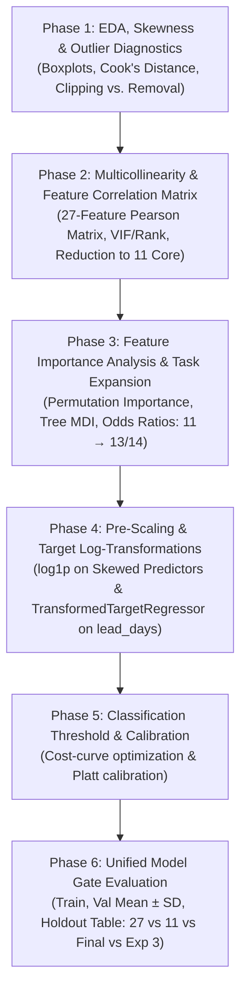

# Experiment 3 Execution Plan: Rigorous, Contained & Syllabus-Compliant

**Author:** Team 11  
**Target Course Syllabus:** IT5006 Machine Learning Modules (Week 01 – Week 08 Tutorial Labs)  
**Containment Status:** 100% Isolated in `experiments/experiment_3/` and `artifacts/metrics/experiment-3/`  
**Execution Rule:** Zero modification to production assets (`src/models/`, `data/`, `artifacts/metrics/refinement-selected-v3/`, `docs/reports/`) until explicit user authorization.

---

## 1. Containment Architecture & Directory Layout

To guarantee complete safety, Experiment 3 runs entirely within an isolated sandbox. Only after results are audited and verified against pre-declared significance gates will winning components be promoted into the primary codebase.

```
/Users/bensonwu/Projects/IT5006_GRP11/
├── experiments/experiment_3/              <-- ISOLATED CODE & RUNNERS
│   ├── TO_TEST_LIST.md                     <-- Master hypothesis tracker
│   ├── PLAN.md                             <-- This execution plan
│   ├── run_eda_outliers.py                 <-- Phase 1: Skewness & outlier diagnostic script
│   ├── run_collinearity_reduction.py       <-- Phase 2: Correlation matrix & feature reduction script
│   ├── run_feature_importance_expansion.py <-- Phase 3: Importance analysis & expansion script
│   ├── run_target_transform.py             <-- Phase 4: Log target & predictor scaling script
│   ├── run_threshold_optimization.py       <-- Phase 5: Classification cost-curve tuning
│   └── run_unified_evaluation.py           <-- Phase 6: 3-column model gate benchmark
└── artifacts/metrics/experiment-3/         <-- ISOLATED OUTPUTS & FIGURES
    ├── eda/                                <-- Boxplots, histograms, Cook's distance scatter plots
    ├── feature_selection/                  <-- Correlation heatmaps, VIF/rank reports, importance bar charts
    ├── fold_metrics.csv                    <-- 5-fold CV metrics across all trials
    ├── terminal_metrics.csv                <-- Holdout verification metrics
    └── comparison_summary.csv              <-- Unified evaluation comparison tables
```

---

## 2. Curriculum Compliance Matrix (IT5006 Weeks 01–08 Labs)

Every method, model, and diagnostic in Experiment 3 strictly maps to techniques taught in the course tutorial notebooks (`docs/Tutorial/`):

| Tutorial / Week | Lab Source Notebook | Taught Methodology Applied in Experiment 3 |
| :--- | :--- | :--- |
| **Week 01–02** | `T1.ipynb`, `T2.ipynb` | Descriptive statistics (`describe()`, `skew()`, `kurtosis()`), IQR bounds ($Q_1 - 1.5\text{IQR}, Q_3 + 1.5\text{IQR}$), boxplots, histograms, and business domain filtering. |
| **Week 03** | `T03.ipynb` | Scikit-learn `Pipeline`, `ColumnTransformer`, `SimpleImputer(strategy="median")`, `StandardScaler`, `OneHotEncoder(drop="first")`, `FunctionTransformer(np.log1p)`, quantile clipping (`np.clip`). |
| **Week 04** | `T04.ipynb` | Chronological/stratified train-test partitioning, confusion matrix, precision, recall, F1, model persistence. |
| **Week 05** | `T05.ipynb` | Multiple Linear Regression: Correlation matrix (`advertising.corr()`), surrogate credit effects, multicollinearity & condition numbers, log-transformed response $\log(y)$ and predictors ($\log(x)$), residual diagnostic plots, heteroscedasticity inspection, and Cook's distance for influential outliers. |
| **Week 07** | `T07_Main.ipynb`, `IT5006_Agentic_Logistic_Regression_Student.ipynb` | Regularized Logistic Regression ($L_2$ penalty), `predict_proba()`, Precision-Recall Curves, Average Precision (PR-AUC), Brier score, probability calibration, and asymmetric cost threshold tuning ($C_{\text{FP}} : C_{\text{FN}}$). |
| **Week 08** | `T08_Classficiation_Models.ipynb` | Standardized logistic feature importance via Odds Ratios ($OR = e^\beta$, horizontal bar charts with green/red coloring), Tree & Random Forest MDI Impurity Importances (`model.feature_importances_`), Permutation Feature Importance (`permutation_importance`), Decision Trees, Random Forests, and multi-model benchmark tables. |

*(Note: Advanced non-curriculum libraries such as XGBoost, LightGBM, CatBoost, or Neural Networks are strictly prohibited).*

---

## 3. Step-by-Step Execution Phases



---

### Phase 1: Skewness Audit, Outlier Diagnostics & Business Scenario Evaluation
* **Lab References:** `T2.ipynb` (Food Delivery Time outliers & boxplots), `T05.ipynb` (Cook's distance & residual leverage).
* **Script:** `experiments/experiment_3/run_eda_outliers.py`
* **Workflow:**
  1. *Skewness & Tail Profile:* Calculate skewness ($g_1$), kurtosis ($g_2$), P50, P90, P95, P99, and Max for `lead_days`, `total_price`, `total_freight`, and `distance_km_max`.
  2. *Diagnostic Figures:*
     - Generate Boxplots & Violin plots of raw vs. log-scaled distributions (`artifacts/metrics/experiment-3/eda/boxplots_skew.png`).
     - Generate Scatter Plots of `lead_days` vs. `distance_km_max` with Cook's distance contours to identify high-leverage points (`artifacts/metrics/experiment-3/eda/cooks_distance.png`).
     - Generate Monthly Cohort Anomaly Charts to check if extreme delays cluster around postal strikes or Black Friday surges (`artifacts/metrics/experiment-3/eda/delay_seasonality.png`).
  3. *Business Evaluation Framework (Clipping vs. Removal):*
     - **Dropping Records:** Categorically rejected for legitimate delayed shipments because delayed orders represent real customers who experienced delivery failures and wrote 1-star reviews. Silently deleting them introduces severe survival bias. Only un-physical logging bugs (e.g. delivered before purchased) may be excluded.
     - **Clipping (Winsorization):** Capping `lead_days` at 60 days and `total_freight` at P99 bounds the quadratic loss $(y - \hat{y})^2$ so single 150-day outliers cannot hijack tree splits or linear slope, while preserving customer records.
  4. *3-Way Empirical Benchmark:*
     - Trial 1A: Raw Untreated Data (Current Baseline)
     - Trial 1B: Clipped/Winsorized Data (Target capped at 60 days, freight capped at P99)
     - Trial 1C: Filtered Data (Orders $> 60$ days removed from training only)

---

### Phase 2: Multicollinearity Audit, Feature Correlation Matrix & Feature Reduction (27 $\rightarrow$ 11)
* **Lab References:** `T05.ipynb` (Advertising correlation matrix `corr()`, surrogate credit effect, condition number, VIF).
* **Script:** `experiments/experiment_3/run_collinearity_reduction.py`
* **Workflow:**
  1. *27-Feature Pairwise Pearson Correlation Matrix:*
     - Compute the full pairwise Pearson correlation matrix across all numeric candidate predictors.
     - Generate an annotated heatmap (`artifacts/metrics/experiment-3/feature_selection/correlation_matrix_27.png`) using `sns.heatmap(df.corr(), annot=True)`.
     - Highlight key collinear clusters:
       - Physical volume & weight: $\text{Corr}(\text{total\_weight\_g}, \text{total\_volume\_cm3}) = 0.824$.
       - Missing indicators: $\text{Corr}(\text{weight\_missing\_fraction}, \text{volume\_missing\_fraction}) = 0.873$.
       - Spatial transit: $\text{Corr}(\text{distance\_km\_max}, \text{interstate\_share}) = 0.568$.
       - Assortment complexity: $\text{Corr}(\text{n\_products}, \text{n\_sellers}) = 0.605$.
       - Category completeness: $\text{Corr}(\text{category\_missing\_fraction}, \text{n\_categories}) = -0.788$.
  2. *Multicollinearity Diagnostics & Matrix Rank Deficiency:*
     - Compute the non-zero condition number ($\kappa$) of the unregularized design matrix.
     - Verify numerical matrix rank vs. nominal columns ($p$) to detect linear dependencies caused by high-cardinality one-hot encoding.
     - Formulate the dummy variable trap check: verify `drop="first"` implementation for linear/logistic models.
  3. *Justified Reduction from 27 to 11 Core Features:*
     - **Prune Physical Block (4 features):** Extreme collinearity ($r=0.824$), heavy right-skew, high missingness requiring imputation.
     - **Prune Category Block (2 features):** 71 sparse dummy levels causing rank deficiency ($\text{rank}=170$ vs 187) and condition explosion ($\kappa > 1400$).
     - **Prune Payment Block (4 features):** Retrospective multi-voucher timestamps pose post-checkout leakage risks.
     - **Hold Out Seller/Distance Blocks (6 features):** Kept aside for controlled ablation to test task-specific contributions.
     - **Resulting 11 Core Features:** `n_items`, `has_items`, `n_products`, `total_price`, `total_freight`, `freight_ratio`, `freight_ratio_missing`, `customer_state`, `purchase_month`, `purchase_dayofweek`, `purchase_hour`.

---

### Phase 3: Feature Importance Analysis & Task-Specific Feature Expansion (11 $\rightarrow$ 13 Reg / 14 Clf)
* **Lab References:** `T08_Classficiation_Models.ipynb` (Odds Ratios & Horizontal Bar Charts in Cell 33; Random Forest Importances in Cell 46).
* **Script:** `experiments/experiment_3/run_feature_importance_expansion.py`
* **Workflow:**
  1. *Tri-Method Feature Importance Profiling:*
     - **Out-of-Fold Permutation Importance:** Calculate degradation in primary metric ($\Delta \text{MAE}$ for regression; $\Delta \text{AP}$ for classification) when shuffling each feature across 5 folds (`permutation_importance`).
     - **Tree Impurity Feature Importance (MDI):** Extract Gini / MSE variance reduction from Decision Trees and Random Forests (`model.feature_importances_`).
     - **Standardized Logistic Regression Odds Ratios:** Extract standardized coefficients $\beta_j$ and calculate multiplicative odds multipliers ($OR = \exp(\beta_j)$) and percentage impact ($(\exp(\beta_j) - 1) \times 100\%$).
  2. *Visual Feature Importance Bar Charts:*
     - Generate horizontal bar plots (`artifacts/metrics/experiment-3/feature_selection/feature_importance_bars.png`) styled after `T08` Cell 33 (green for protective/delay-reducing features, red for risk/delay-increasing features).
  3. *Hypothesis-Driven Feature Expansion:*
     - **Task 1 Regression Expansion (11 $\rightarrow$ 13 Features):** Add `distance_km_max` and `distance_missing_fraction`. Justified by #1 permutation importance ($+0.9545$ days MAE degradation) and $27.58\%$ tree impurity. Other blocks rejected (Physical gained only $+0.0428$d; Categories gained $+0.0389$d, failing the $0.05$-day threshold).
     - **Task 2 Classification Expansion (11 $\rightarrow$ 14 Features):** Add `n_sellers`, `primary_seller_state`, and `interstate_share`. Justified by top odds ratios ($OR = 1.182$ for sellers, $1.129$ for interstate) and AP drop. Distance rejected for classification (only $+0.0003$ AP gain, failing 3/5 folds).
  4. *Feature Regime Score Comparison Table:*
     - Benchmark 27 Features vs. 11 Core Features vs. Final 13/14 Features side-by-side across 5-fold CV.

---

### Phase 4: Pre-Scaling, Target Log-Transformations & GridSearchCV Model Tuning
* **Lab References:**
  - `T03.ipynb` (Transformers & Preprocessing: `FunctionTransformer(np.log1p)`).
  - `T05.ipynb` (Logarithmic feature transformation & response transformation: `np.log(y) ~ X`).
  - `T07_Main.ipynb` & `T08_Classficiation_Models.ipynb` (Section 5.2 & Section 6.2: `GridSearchCV` hyperparameter tuning, param grids, cv results).
* **Script:** `experiments/experiment_3/run_phase4_transforms_and_tuning.py`
* **Workflow:**
  1. *Phase 4A: Pre-Scaling Predictor Log-Transformation & Target Transformation:*
     - For continuous predictors with skewness $g_1 > 1.5$ (`total_price`, `total_freight`, `distance_km_max`), chain $\log(1+x)$ (`np.log1p`) **before** `StandardScaler()`:
       $$\text{Raw } x \xrightarrow{\text{SimpleImputer(strategy='median')}} \xrightarrow{\text{FunctionTransformer(np.log1p)}} \xrightarrow{\text{StandardScaler()}} \text{Model}$$
     - Target log-transformation on `lead_days` via `TransformedTargetRegressor(regressor, func=np.log1p, inverse_func=np.expm1)`:
       $$y^* = \log(1 + y), \quad \hat{y} = \exp(\hat{y}^*) - 1$$
     - Measure metric changes across raw vs log-transformed target.
  2. *Phase 4B: Full GridSearchCV Hyperparameter Tuning across All Candidate Models:*
     - Avoid "default hyperparameter bias" by tuning **all** candidate models on the optimal transformed feature pipelines:
       - **Regression:**
         - Ridge: Tune `alpha` $\in [0.01, 0.1, 1.0, 10.0, 100.0, 500.0]$
         - Decision Tree: Tune `max_depth` $\in [4, 6, 8, 10, 12]$, `min_samples_leaf` $\in [20, 50, 100, 200]$
         - Random Forest: Tune `max_depth` $\in [6, 10, 14]$, `min_samples_leaf` $\in [20, 50, 100]$, `n_estimators` $\in [50, 100]$
       - **Classification:**
         - Logistic Regression: Tune `C` $\in [0.001, 0.01, 0.1, 1.0, 10.0]$
         - Decision Tree: Tune `max_depth` $\in [4, 6, 8, 10, 12]$, `min_samples_leaf` $\in [20, 50, 100, 200]$
         - Random Forest: Tune `max_depth` $\in [6, 10, 14]$, `min_samples_leaf` $\in [20, 50, 100]$, `n_estimators` $\in [50, 100]$
     - Compare Default vs Tuned models in a unified comparison table to identify the true optimal architecture.

---

### Phase 5: Classification Probability Calibration & Decision Policy Optimization
* **Lab References:** `T07_Main.ipynb` (Asymmetric Cost Optimization), `T08_Classficiation_Models.ipynb` (PR Curves & Calibration).
* **Script:** `experiments/experiment_3/run_threshold_optimization.py`
* **Workflow:**
  1. Re-evaluate probability threshold $\tau \in [0.05, 0.50]$ across 3 business cost scenarios:
     - Balanced / Cost-neutral: $C_{\text{FP}} = C_{\text{FN}} = 1$
     - Moderate Proactive Support: $C_{\text{FP}} = 1, C_{\text{FN}} = 5$ (Current baseline)
     - High Retention Priority: $C_{\text{FP}} = 1, C_{\text{FN}} = 10$
  2. Evaluate probability calibration using reliability diagrams and Platt scaling (`CalibratedClassifierCV(method="sigmoid", cv="prefit")`).
  3. Record trade-offs between Alert Volume (operational burden) and False Negative reduction (prevented customer churn).

---

### Phase 6: Unified Model Gate Evaluation & Reporting
* **Lab References:** `T08_Classficiation_Models.ipynb` (Model Comparison Tables & Diagnostics).
* **Script:** `experiments/experiment_3/run_unified_evaluation.py`
* **Workflow:**
  1. Output a unified, teacher-ready comparative evaluation table across:
     - 27-Feature Full Candidate Set
     - 11-Feature Core Baseline
     - Milestone 2 Selected Models (13 Reg / 14 Clf)
     - Experiment 3 Winning Candidate Pipelines
  2. Each row must display:
     - **Train Resubstitution Metric** (to diagnose underfitting)
     - **5-Fold Cross-Validation Mean $\pm$ SD** (generalization stability)
     - **Terminal Holdout Metric** (unseen out-of-period transfer)
     - **Overfitting Gap** ($\Delta = |\text{Train} - \text{Val}|$)
     - **Pre-declared Significance Decision** (Adopt / Reject)

---

## 4. Pre-Declared Adoption Gates & Quality Criteria

A candidate component from Experiment 3 will ONLY be recommended for inclusion into the primary working pipeline if it meets all of the following:

1. **Regression Gate:** Achieves an improvement of $\Delta \text{MAE} > 0.05$ days on 5-fold cross-validation across at least 4/5 folds, AND achieves positive $R^2 > 0.0$ on the terminal holdout.
2. **Classification Gate:** Achieves an improvement of $\Delta \text{Average Precision} > 0.005$ across at least 4/5 folds with a well-calibrated Brier score ($\le 0.125$).
3. **Parsimony Gate:** Feature expansion beyond the 11-core baseline must be justified by top permutation importance and non-collinearity.
4. **Reproducibility Gate:** All random states frozen, zero test data leakage, fully reproducible via single-command script execution.
