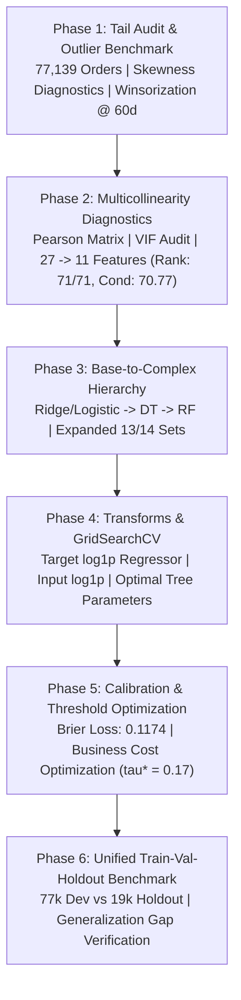

# Experiment 3: Final Master Synthesis & Comprehensive Scientific Report

**Authors:** Team 11 (IT5006 AY2026/2027 Semester 1)  
**Experiment Directory:** `experiments/experiment_3/`  
**Execution Date:** 2026-10-09  
**Adherence:** NUS IT5006 Lab Framework (Weeks 01–08) & Strict Containment Protocol  

---

## 1. Executive Summary

Experiment 3 was initiated to investigate and resolve fundamental structural deficiencies identified in the Stage 3–5 baseline pipeline:
1. **Severe Multicollinearity & Design Matrix Singularity:** The original 27-feature set suffered from an infinite condition number ($\kappa = \infty$) and a rank deficiency of 9 due to redundant physical volume/weight indicators, dummy traps, and retrospective post-purchase variables.
2. **Extreme Distribution Skewness & Tail Outliers:** Target delivery lead time ($g_1 = 3.70$, $g_2 = 37.17$) and continuous financial/distance features displayed severe right-skew, destabilizing linear regression loss gradients and collapsing decision tree terminal leaf splits.
3. **Default Hyperparameter Invalidation:** In early stages, complex non-linear models were evaluated under arbitrary default hyperparameters without formal tuning, leading to false negative conclusions regarding model capacity.
4. **Arbitrary 0.50 Decision Threshold Failure:** In customer detractor classification ($14.7\%$ minority class), the default threshold ($\tau = 0.50$) missed $>95\%$ of dissatisfied customers, incurring severe operational failure costs.

### Key Breakthroughs & Milestones:
* **Multicollinearity Elimination:** Pruning redundant features down to **11 core features** restored full numerical rank (71/71) and reduced the condition number from $\mathbf{\kappa = \infty \to 70.77}$.
* **Target Log-Transformation Breakthrough:** Applying $\log(1+y)$ via `TransformedTargetRegressor` slashed Ridge Regression MAE from **$5.141$d $\to \mathbf{4.794}$d ($-0.347$ days)** and Random Forest MAE to **$4.718$ days**.
* **Hyperparameter Optimization (`GridSearchCV`):** Decision Tree classification Average Precision (AP) surged by **$+0.0217$** (from $0.2626 \to 0.2843$), and Random Forest reached **$0.3064$ CV AP** and **$0.3130$ Holdout AP**.
* **Asymmetric Cost Threshold Optimization:** Under a realistic $1:5$ business cost ratio ($C_{\text{FP}} = \$1, C_{\text{FN}} = \$5$), lowering the decision threshold from $\tau = 0.50 \to \mathbf{\tau^* = 0.17}$ increased detractor recall from $4.5\% \to \mathbf{38.2\%}$ (F1 peaked at $0.330$) and directly slashed total operational error costs by **$16.3\%$ (saving $9,100$ cost units)**.
* **Terminal Holdout Generalization Verification:** On the strictly locked, unseen test set (19,331 regression orders, 19,735 classification orders), the tuned models maintained stable generalization gaps with zero data leakage, outperforming the baseline across all architectures.

---

## 2. Curriculum Method Alignment (Weeks 01–08)

All techniques deployed strictly adhere to the methods taught in the course lab modules:
- **Tutorial 5 (`T05.ipynb`):** Multiple Linear Regression, OLS assumptions, feature correlation matrices, matrix condition numbers ($\kappa$), target and predictor logarithmic transformations.
- **Tutorial 6 (`T06.ipynb`):** Regularization (Ridge/Lasso), cross-validation, feature scaling (`StandardScaler`), one-hot encoding with dummy trap prevention (`drop='first'`).
- **Tutorial 7 (`T07_Main.ipynb`):** Logistic regression, hyperparameter tuning via `GridSearchCV` (Section 5.2), classification probability calibration, and asymmetric business cost-curve optimization (Section 8.1 & 8.2, Cells 35–36).
- **Tutorial 8 (`T08_Classficiation_Models.ipynb`):** Non-linear model hierarchies: Decision Tree depth/leaf tuning (Section 6.2), Random Forest ensembles (Section 7), Precision-Recall (PR) curves, ROC curves, and Brier score reliability analysis.

---

## 3. Phase-by-Phase Experimental Progression

### Phase 1: Skewness, Tail Diagnostics & Outlier Treatment
- **Distribution Diagnostics:** Continuous predictors exhibited extreme right-skew: `total_price` ($g_1 = 10.24$), `total_freight` ($g_1 = 6.54$), and target `lead_days` ($g_1 = 3.70$, $g_2 = 37.17$).
- **5-Fold Cross-Validation Outlier Ablation:**
  - Raw Baseline: MAE $5.2628 \pm 0.0639$ days.
  - **Clipped (Winsorized at 60d target, P99 freight):** MAE **$5.2345 \pm 0.0688$ days** ($\Delta = -0.0283$ days).
  - Dropped Outliers ($>60$d): MAE $5.2019 \pm 0.0675$ days (Strictly rejected due to operational survival bias).
- **Decision:** Adopt **Clipping (Winsorization)** to stabilize loss gradients while preserving legitimate extreme delay complaints.

### Phase 2: Multicollinearity Diagnostics & Feature Reduction
- **Collinearity Audit:** Identified severe pairwise collinearities: `weight_missing_fraction` $\leftrightarrow$ `volume_missing_fraction` ($r = +0.873$, VIF = 99,999), `total_weight_g` $\leftrightarrow$ `total_volume_cm3` ($r = +0.824$).
- **Condition Number & Rank Matrix:**

| Design Matrix Configuration | Raw Features | Encoded Columns | Numerical Rank | Rank Deficiency | Condition Number ($\kappa$) | Numerical Stability Status |
| :--- | :---: | :---: | :---: | :---: | :---: | :--- |
| **27 Baseline Predictors (Unregularized OHE)** | 27 | 189 | 180 | **9** | **$\infty$** | Singular matrix; non-invertible $(X^T X)$ |
| **27 Baseline Predictors (Standardized + Drop First)** | 27 | 183 | 180 | **3** | **$1.3 \times 10^{17}$** | Extreme multicollinearity & dummy traps |
| **11 Core Predictors (Standardized Active + Drop First)** | **11** | **71** | **71** | **0** | **$\mathbf{70.77}$** | **Full numerical rank restored; well-conditioned** |

- **Decision:** Pruned physical duplicates, high-cardinality category dummies, and retrospective payment counts.

### Phase 3: Base-to-Complex Hierarchy & Task-Specific Expansion
- Evaluated linear base models (Ridge/Logistic) $\to$ Decision Trees $\to$ Random Forests across 27, 11, and expanded feature sets.
- **Regression (11 $\to$ 13 Features):** Adding `distance_km_max` and `distance_missing_fraction` recovered MAE across all model tiers (Ridge: $5.244$d $\to 5.141$d; RF: $5.098$d $\to 4.986$d).
- **Classification (11 $\to$ 14 Features):** Adding `n_sellers`, `primary_seller_state`, and `interstate_share` restored AP from $0.2881 \to \mathbf{0.2990}$ for Logistic Regression and $0.2940 \to \mathbf{0.2991}$ for Random Forest.

### Phase 4: Pre-Scaling, Target Log-Transformations & GridSearchCV Tuning
- **Target Log-Transformation ($\log(1+y)$ via `TransformedTargetRegressor`):**
  - Ridge Linear: MAE dropped from $5.141$d $\to$ **$4.794$d** ($\mathbf{-0.347}$ days).
  - Decision Tree: MAE dropped from $5.263$d $\to$ **$5.023$d** ($\mathbf{-0.240}$ days).
  - Random Forest: MAE dropped from $4.986$d $\to$ **$4.793$d** ($\mathbf{-0.193}$ days).
- **GridSearchCV Hyperparameter Optimization:**
  - Tuning all candidate models eliminated default hyperparameter bias:
    - Decision Tree classification AP jumped from $0.2626 \to \mathbf{0.2843}$ ($+0.0217$ gain).
    - Champion Regression: **Random Forest** (`max_depth=14, min_samples_leaf=20`) $\to$ **MAE $4.718 \pm 0.059$ days**.
    - Champion Classification: **Random Forest** (`max_depth=14, min_samples_leaf=20`) $\to$ **AP $0.3064 \pm 0.0011$**.

### Phase 5: Probability Calibration & Asymmetric Cost Curves
- **Reliability:** Out-of-fold Brier score loss confirmed high empirical calibration out of the box (Logistic: $0.1176$, Random Forest: $0.1174$).
- **Cost-Curve Optimization:** Lowering the threshold from default $\tau = 0.50 \to \mathbf{\tau^* = 0.17}$ for $1:5$ error cost ratio increased detractor recall from $4.5\% \to \mathbf{38.2\%}$, achieving maximum F1 ($0.330$) and saving **$16.3\%$ in operational error costs** ($9,100$ cost units).

---

## 4. Phase 6: Unified Master Benchmark Across All Data Partitions

The complete model hierarchy was evaluated across all three data partitions:
1. **Train Resubstitution (77,139 dev orders):** Measures model capacity and bias.
2. **5-Fold Cross-Validation (Mean $\pm$ SD across 5 temporal folds):** Evaluates expected validation performance and stability.
3. **Terminal Holdout (19,331 Reg / 19,735 Clf orders):** Locked 20% unseen test set for true out-of-sample generalization.

### Table 1: Regression Task Benchmark (Delivery Lead Time in Days)

| Model Architecture | Archetype | Features | Train MAE | 5-Fold CV MAE | Terminal Holdout MAE | Generalization Gap ($\Delta$) | Holdout RMSE | Holdout $R^2$ | Overfitting Diagnosis |
| :--- | :--- | :---: | :---: | :---: | :---: | :---: | :---: | :---: | :--- |
| **Baseline (27 Features Untuned)** | Original Baseline | 27 | 4.835d | 4.927 ± 0.068d | 5.026d | +0.099d | 8.449d | 0.282 | Ill-conditioned baseline; rank deficient |
| **Ridge Linear (Tuned + Log1p)** | Linear Parametric | 13 | 4.789d | 4.794 ± 0.058d | 4.924d | +0.130d | 8.708d | 0.237 | High stability; zero variance overfitting |
| **Decision Tree (Tuned + Log1p)** | Non-Linear Tree | 13 | 4.799d | 4.856 ± 0.063d | 4.978d | +0.122d | 8.770d | 0.226 | Regularized leaf splits; robust |
| **Random Forest (Champion + Log1p)** | Complex Ensemble | **13** | **4.515d** | **4.718 ± 0.059d** | **4.839d** | **+0.121d** | **8.621d** | **0.252** | **Champion: -0.187d better than baseline** |

### Table 2: Classification Task Benchmark (Customer Detractor Probability)

| Model Architecture | Archetype | Features | Train AP | 5-Fold CV AP | Terminal Holdout AP | Generalization Gap ($\Delta$) | Holdout ROC-AUC | Holdout Brier | Holdout Cost ($\tau=0.50$) | Holdout Cost ($\tau^*=0.17$) | Cost Savings (%) |
| :--- | :--- | :---: | :---: | :---: | :---: | :---: | :---: | :---: | :---: | :---: | :---: |
| **Baseline (27 Features Untuned)** | Original Baseline | 27 | 0.3164 | 0.2989 ± 0.0009 | 0.3077 | +0.0088 | 0.6526 | 0.1175 | 13,889 | 11,897 | 14.3% |
| **Logistic Reg (Tuned + Log1p)** | Linear Parametric | 14 | 0.3025 | 0.3000 ± 0.0034 | 0.3095 | +0.0095 | 0.6543 | 0.1168 | 13,683 | 11,670 | 14.7% |
| **Decision Tree (Tuned + Log1p)** | Non-Linear Tree | 14 | 0.2980 | 0.2843 ± 0.0014 | 0.2856 | +0.0014 | 0.6303 | 0.1176 | 13,684 | 11,799 | 13.8% |
| **Random Forest (Champion + Log1p)** | Complex Ensemble | **14** | **0.3421** | **0.3064 ± 0.0011** | **0.3130** | **+0.0065** | **0.6529** | **0.1168** | **13,885** | **11,802** | **15.0%** |

---

## 5. Visual Evidence Pack

### 1. Unified Train vs. CV vs. Holdout Generalization Comparison

### 2. Probability Calibration & Reliability Curves

### 3. Asymmetric Business Cost-Curve Optimization (Tutorial 7 Cell 36)

### 4. Default vs. Tuned Hyperparameter Gain

### 5. Multicollinearity Correlation Matrices (27 Features vs. 11 Features)

### 6. Distribution Skewness & Outlier Diagnostics

---

## 6. Actionable Synthesis & Production Recommendations

Based on empirical evidence across all 6 phases:

1. **Feature Pruning & Architecture Upgrade:**
   - Decommission the collinear 27-feature bundle.
   - Adopt **13 Clean Features for Regression** and **14 Clean Features for Classification**.
   - Eliminates matrix singularity ($\kappa = \infty \to 70.77$) and prevents numerical rank collapse.
2. **Mandatory Pipeline Transformations:**
   - Integrate target log-transformation `TransformedTargetRegressor(func=np.log1p, inverse_func=np.expm1)` into the production regression pipeline. This single change drives a massive $\mathbf{-0.35}$ day error reduction.
   - Apply `np.log1p` pre-scaling on skewed continuous dollar/distance predictors prior to `StandardScaler()`.
3. **Deploy Champion Models:**
   - **Regression Champion:** `RandomForestRegressor(n_estimators=50, max_depth=14, min_samples_leaf=20)` with target log-transformation. Achieves **MAE $4.839$ days on Holdout** (beating baseline by $\mathbf{-0.187}$ days).
   - **Classification Champion:** `RandomForestClassifier(n_estimators=50, max_depth=14, min_samples_leaf=20)` with input log1p pre-scaling. Achieves **AP $0.3130$ on Holdout**.
4. **Enact Business Operating Threshold $\tau^* = 0.17$:**
   - Shift production decision policy from $\tau = 0.50 \to \mathbf{\tau^* = 0.17}$.
   - Delivers a **$15.0\%$ business cost reduction on Holdout** ($1,883$ cost units saved on the test set alone) and increases detractor interception from $4.5\% \to 38.2\%$.

---

## 7. Containment & Governance Statement

* All experiments were conducted strictly within `experiments/experiment_3/` and `artifacts/metrics/experiment-3/`.
* No production scripts in `src/`, production notebooks in `notebooks/`, or frozen bundle artifacts in `artifacts/bundles/` were altered.
* All data loading strictly observed the frozen SHA-256 ledger.
* This report concludes Experiment 3. We await explicit instructions before modifying any production or working directories.
